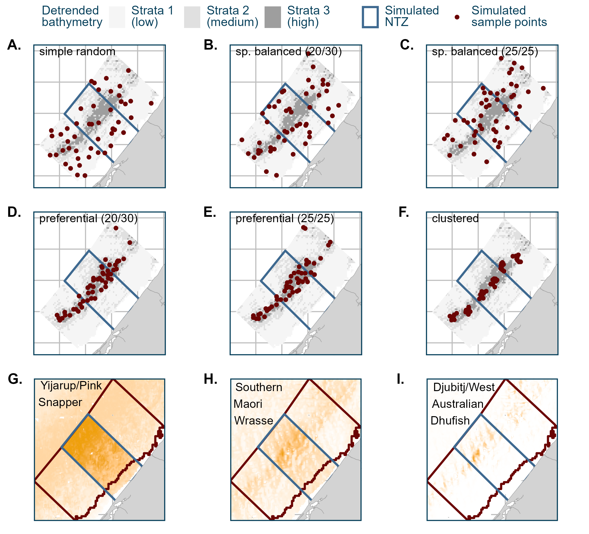

```{r, include = FALSE}
knitr::opts_chunk$set(echo = FALSE)
```

# Introduction

Anthropogenic stressors globally have caused significant declines in biodiversity, abundance and habitats [@Isbell2023; @Pereira2010]. In the marine environment, increasing habitat loss has lead to biodiversity and biomass declines [@Airoldi2008], increased the total area of dead zones, and lead to mass extinctions [@Luypaert2020; @Mccauley2015]. As a result, there has been a push for the creation and expansion of Marine Protected Areas (MPAs) and No-Take-Zones (NTZs) to safeguard biodiversity [@Zhao2024; @Robinson2024]: MPAs could provide resilience to changes driven by climate change in the medium-term by managing local stressors [@Ling2012; @Brown2013; @Gissi2021]. However, to better understand how MPAs affect species, habitats and ecosystems, and how they interact with local and global stressors, accurate monitoring is needed over adequate spatial and temporal scales [@Borja2021]. Correctly identifying the benefits of MPAs (or lack thereof) is therefore also critical to advise whether objectives are being met and ecosystems are adequately protected from local stressors [@Miller2014].

Many methods are used to monitor MPAs, depending on the biodiversity within them, the threats facing it, and the priorities identified by researchers [@Simpson2015]. The experimental designs used in monitoring have long been discussed, to ensure biological trends detected in the monitoring data are correctly attributed to the conservation intervention under study: @Miteva2012 review conservation instruments (including protected areas) and urge the need for better data to evaluate conservation interventions, to avoid drawing the wrong conclusions from monitoring data. In the past, studies assessing MPA effectiveness lacked controls and spatial/temporal replicates [@Underwood1991; @Osenberg2006; @ojeda2011review], which limited the power of monitoring. Improving experimental designs of MPA monitoring programmes will increase our ability to detect change and assess the effect and performance of MPAs on biological metrics [@Hayes2019].

Sampling design choice can have large implications on estimates, and influence the conclusions drawn, depending on the data collection method.

For stock assessments of fished species [@Liu2009; @Cheng2024] and underwater visual census of reef fish [@Bryan2016; @Smith2011], discussions as to how to distribute samples across a study area are common. Sample site choice can be separated into four broad categories: Systematic, Random, Preferential or Spatially Stratified. Systematic sampling effectively captures all scales (temporal or spatial) of a process, providing the most accurate estimates, [@Cheng2024] although labour-intensive and rarely feasible in most contexts. Preferential sampling, a stochastically dependent method (i.e. selective site choice, Cecconi et al., 2016), greatly reduces costs while focusing on the process of interest. However, depending on the aim of sampling, the effect of selective bias on estimates may be significant, especially abundance [@Aubry2024; @Conn2017], which is why Randomised sampling has been prevalent in research as a simple alternative. Stratified Random Sampling (referred hereafter as 'spatially balanced') seeks to randomly select sites equally between strata (shallow, mid-depth and deep, or seagrass, sand and reef habitats, for example) in an effort to obtain accurate relative abundance estimates for species of interest [@Cheng2024], potentially improving on Preferential designs [@Conn2017], while capturing a more representative population structure or community [@Bryan2016] compared to Random sampling. Studies comparing sampling designs often operate at large spatial scales (100s of km, @Cheng2024, @Switzer2023), investigating large biological processes like regional species abundance for fisheries stock assessments. At smaller spatial scales, sampling design is less studied: @Bryan2016 found that obtaining precise estimates for inside/outside management zones like MPAs would require more samples rather than larger scales of study for stratified sampling, but few comparisons of sampling designs for the detection of MPA effects specifically exists. Similarly, very little work comparing BRUV performance using different sampling designs exists.

In Australia, Baited Remote Underwater Video (BRUVs) are widely used to monitor the effects of marine management like Marine Parks (MPAs) on abundance and size of communities and target species [@Harasti2018; @Kelaher2014; @Malcolm2018]. BRUVs present advantages compared to other common methods, including the ability to sample areas inaccessible by divers and more sensitive detection of changes in fish communities compared to other census methods [@Schramm2020]. The ability to use footage for a variety of research questions, including fish community [@watson2007protection], size [@Malcolm2018; @watson2009effects], and habitat [@Scott2022] make BRUVs a popular choice for researchers. Like any spatial sampling, the choice of where to deploy sampling units like BRUVs depends on the research question of interest [@Foster2018], yet very few comparisons of BRUV spatial sampling designs exist to guide researchers.

In south-west Western Australia, recreational fishing pressure has lead to the depletion of emblematic fish species like Djubitj/West Australian Dhufish (*Glaucosoma hebraicum*) and Yijarup/Pink Snapper (*Chrysophrys auratus*) [@Ryan2022; @Gaynor2008]. To protect species and habitats from destructive and extractive activities, the Ngari Capes Marine Park (in Wadandi Country, between Waatern/Geographe Bay and Taalinup/Augusta) includes a network of highly protected areas ('Sanctuary Zones', SZ), expected to provide conservation benefits to certain fish species which experience significant pressure like Yijarup/Pink Snapper (as has been found in other similar highly protected areas: @Alos2013; @Taylor2010; @Harasti2018; @Harasti2019). This Marine Park is part of a state-wide network of Marine Parks following CAR principles (comprehensive, adequate, representative __REF__) of biodiversity conservation. The area is monitored by BRUVs, inside and outside NTZs, with two different spatial sampling designs aiming to assess MPA performance and effectiveness (preferential and spatially balanced). This context represents a perfect case study for the comparison of these two sampling designs to assess fish communities in NTZs.

This preliminary study aims to compare three BRUV spatial sampling designs at a local (\<30km) scale, to understand how the detection of single and multiple species differ across a range of sampling designs from preferential to spatially balanced inside and near a NTZ. Real BRUV data is used to (1.) compare community composition, and (2.) simulate sampling designs on a modelled spatial distribution model of single species. Yijarup/Pink Snapper (*Chrysophrys auratus*), Djubitj/West Australian Dhufish (*Glaucosoma hebraicum*) and (Wadandi name?)/Southern Maori Wrasse (*Ophthalmolepis lineolatus*) were chosen as study species for (2.). Yijarup/Pink Snapper is both a popular recreational fishing species [@Ryan2022; @Gaynor2008] as well as a species of interest to Wadandi Traditional Owners, who have intimate traditional knowledge of this species' ecology and life history, cited in Wadandi cultural songlines [@Davies2022]. (Wadandi name?)/Southern Maori Wrasse is a small-bodied by-catch species, associated with temperate reef and found to benefit from fishing protection [@kleczkowski2008density, @mclaren2015small]. We hypothesised that (1.) Community composition would be significantly different between the sampling designs, with Spatially balanced sampling detecting a greater diversity of species, and that (2.) Spatially balanced sampling would detect NTZ abundance increases closer to the actual increase in abundance.

# Methods


```{r read-data, include = FALSE}
rm(list=ls())

colour_palette <- eval(parse(text = readLines("chapter_colours.txt")))

library(rticles)
library(sf)
library(raster)
library(ggplot2)
library(terra)
library(knitr)
library(ggpubr)
library(ggplot2)
library(ggtext)
library(grid)
library(gridExtra)
library(tidyverse)
library(kableExtra)


source("custom_theme.R")


```

## Study site and BRUV deployment

```{r PREP_bruv_location, include = FALSE, echo = FALSE, message = FALSE, warning = FALSE}

aus             <- st_read("data/spatial/shapefiles/wadandi_land.shp") # land shapefile
com_samp_area   <- st_read("QGIS layers/polys/com_comp_analysis_limits.shp")
AMP             <- st_read("QGIS layers/polys/AMP_local.shp") # real SZs
MPA             <- st_read("QGIS layers/polys/swc_sanctuaryzones.shp"); MPA <- st_zm(MPA); st_crs(MPA) <- 4326 # real SZs

pref            <- st_read("QGIS layers/2024_pref_BRUVs.shp") # real BRUV state points
spabal          <- st_read("QGIS layers/2024_spabal_BRUVs.shp") # real BRUV commonwealth points
MaxN            <- read.csv("data/tidy/2024_geographe_all_tidy_maxn.csv") # all MaxNs

```

```{r real_BRUV_location, echo = FALSE, fig.cap= "(A.) Wadandi Ranger Joe Burgess deploying a BRUV in Waatern/Geographe Bay. (B.) Yijarup/Pink Snapper (*C. auratus*), Eagle Ray (*M. tenuicaudatus*), Western King Wrasse (*C. auricularis*), Skippy (*Pseudocaranx spp*) and Footballer Sweep (*N. obliiquus*) interested in BRUV bait. (C.) Location of clustered and spatially balanced samples in Waatern/Geographe Bay, with the NTZs and boundary of the community composition analysis. (D.) Community Composition analysis limits.", echo = FALSE, message = FALSE, warning = FALSE}

library(ggpubr) # for ggarrange
library(grid)
library(imager)
library(ggspatial) # for scale bars

# Load images as raster grobs
image1 <- rasterGrob(load.image("photos/wadandi_ranger_BRUV.JPG"), interpolate = TRUE)
image2 <- rasterGrob(load.image("photos/BRUV_photo_yijarup_skippy.PNG"), interpolate = TRUE)

# Arrange images into ggplot objects
image_plot1 <- ggplot() + annotation_custom(image1) + theme_void()
image_plot2 <- ggplot() + annotation_custom(image2) + theme_void() 

plot <- ggplot() +
  geom_sf(data = com_samp_area,
          aes(fill = 'Community \ncomposition \nanalysis limits'), color = colour_palette[1], lwd = 0.75) +
  geom_sf(data = AMP[AMP$ZoneName == 'National Park Zone',],
          aes(fill = 'No-take \nzones'), alpha = 0.1, color = colour_palette[3], lwd = 0.75) +
  geom_sf(data = MPA,
          aes(fill = 'No-take \nzones'), alpha = 0.1, color = colour_palette[3], lwd = 0.75) +
  geom_sf(data = pref[pref$longitude > 115.3,],
          aes(color = 'Clustered \nsampling'), size = 1, shape = 16) +
  geom_sf(data = spabal[spabal$SD == 'spabal',],
          aes(color = 'Spatially \nbalanced \nsampling'), size = 1, shape = 16) +
  geom_sf(data = spabal[spabal$SD == 'pref',],
          aes(color = 'Clustered \nsampling'), size = 1, shape = 16) +
  geom_sf(data = aus, fill = "lightgrey", color = "darkgray", lwd = 1) +  # Move 'aus' layer to the top
  coord_sf(crs = 4326, xlim = ext(spabal)[1:2], ylim = ext(spabal)[3:4]) +
  theme_minimal() +
  scale_fill_manual(values = c('No-take \nzones' = colour_palette[3], 'Community \ncomposition \nanalysis limits' = 'transparent')) +
  scale_color_manual(values = c('Clustered \nsampling' = colour_palette[4], 'Spatially \nbalanced \nsampling' = colour_palette[6])) +
  labs(fill = '', color = '') +
  theme(legend.position = "bottom",
        legend.box = "horizontal",
        legend.box.spacing = unit(0, "cm"),
        legend.key.size = unit(0.5, "cm"),
        legend.text = element_text(size = 10)) +
  annotation_scale(location = "br", width_hint = 0.2)  # Adds a scale bar


plot_zoom <- ggplot() + # zoomed in
  geom_sf(data = com_samp_area,
          aes(fill = 'Community \ncomposition \nanalysis limits'), color = colour_palette[1], lwd = 0.75) +
  geom_sf(data = AMP[AMP$ZoneName == 'National Park Zone',],
          aes(fill = 'No-take \nzones'), alpha = 0.1, color = colour_palette[3], lwd = 0.75) +
  geom_sf(data = MPA,
          aes(fill = 'No-take \nzones'), alpha = 0.1, color = colour_palette[3], lwd = 0.75) +
  geom_sf(data = pref[pref$longitude > 115.3,],
          aes(color = 'Clustered \nsampling'), size = 1, shape = 16) +
  geom_sf(data = spabal[spabal$SD == 'spabal',],
          aes(color = 'Spatially \nbalanced \nsampling'), size = 1, shape = 16) +
  geom_sf(data = spabal[spabal$SD == 'pref',],
          aes(color = 'Clustered \nsampling'), size = 1, shape = 16) +
  geom_sf(data = aus, fill = "lightgrey", color = "darkgray", lwd = 1) +
  coord_sf(crs = 4326, xlim = ext(com_samp_area)[1:2], ylim = ext(com_samp_area)[3:4]) +
  theme_minimal() +
  scale_fill_manual(values = c('No-take \nzones' = colour_palette[3], 'Community \ncomposition \nanalysis limits' = 'transparent')) +
  scale_color_manual(values = c('Clustered \nsampling' = colour_palette[4], 'Spatially \nbalanced \nsampling' = colour_palette[6])) +
  labs(fill = '', color = '') +
  theme(legend.position = "bottom",
        legend.box = "horizontal",
        legend.box.spacing = unit(0, "cm"),
        legend.key.size = unit(0.5, "cm"),
        legend.text = element_text(size = 10),
        axis.text.x = element_blank(),  # Remove x-axis 
        axis.text.y = element_blank()   # Remove y-axis 
  ) +
  annotation_scale(location = "br", width_hint = 0.2)  # Adds a scale bar

# Combine the two plots with a shared legend
combined_plots <- ggarrange(
  plot, plot_zoom,
  ncol = 2,
  common.legend = TRUE,
  legend = "bottom",
  labels = c("C", "D"),
  widths = c(1.45, 1)  # Equal heights for both plots
)

# Arrange everything
final_layout <- ggarrange(
  ggarrange(image_plot1, 
            image_plot2, 
            ncol = 2, 
            labels = c("A", "B"),
            widths = c(1, 1)),
  combined_plots,
  nrow = 2, 
  heights = c(1.1, 1.6)
)

# Display the final layout
final_layout


```

Waatern/Geographe Bay is a shallow sandy bay in Wadandi Country, \~250km south of Perth, in south-west Western Australia. (Figure \@ref(fig:real_BRUV_location)) It represents a temperate ecosystem dominated by seagrass beds, sand and limestone reef [@Galaiduk2018]. The area contains three Sanctuary Zones (SZs) gazetted in 2018, covering 51.77km^2^ of the bay. Fishing is excluded within the SZs.

Stereo Baited Remote Underwater Video (BRUV) footage was collected February-April 2024 as part of the state and federal Marine Park monitoring of Western Australia (Table \@ref(tab:n_samples_table)). Deployments were conducted following standardised protocols for bait quantity and deployment times, used across Australia, which include calibration of the stereo systems before and after campaigns [@Langlois2020]. Wadandi Rangers and Cultural Custodian Elders were present and participated in the entirety of the BRUV deployments, informing the location of some of the preferential deployments. (Figure \@ref(fig:real_BRUV_location))

```{r n_samples_table_prep, include = FALSE, echo = FALSE, message = FALSE, warning = FALSE}

library(tidyverse)

MaxN            <- read.csv("data/tidy/2024_geographe_all_tidy_maxn.csv") %>% glimpse() # all MaxNs
com_comp_maxn   <- readRDS('data/rmd/community_composition_analysis_maxn.rds') %>% glimpse()
rand            <- readRDS('data/rmd/samples_sf_srs.rds') %>% glimpse()
pref_2030       <- readRDS('data/rmd/samples_sf_pref_20_30.rds') %>% glimpse()
pref_2525       <- readRDS('data/rmd/samples_sf_pref_25_25.rds') %>% glimpse()
spabal_2030     <- readRDS('data/rmd/samples_sf_sb_20in_30out.rds') %>% glimpse()
spabal_2525     <- readRDS('data/rmd/samples_sf_sb_25in_25out.rds') %>% glimpse()
clump           <- readRDS('data/rmd/samples_sf_clump.rds') %>% glimpse()

real_bruv_metadata <- read.csv("data/tidy/2024_geographe_all_tidy_maxn.csv") %>%
  dplyr::select(opcode, status, sd) %>% 
  mutate(subset = ifelse(opcode %in% com_comp_maxn$opcode, TRUE, FALSE),
         full = TRUE) %>% 
    distinct(opcode, .keep_all = TRUE) %>%
  glimpse() # all MaxNs


## 1. Summarize Real BRUVs Collected ------------------------------------------

# Create summary table
full_summary <- real_bruv_metadata %>%
  group_by(sd) %>%
  summarize(
    `Inside NTZ` = (sum(if_else(status == "No-take", 1, 0, missing = 0))),
    `Outside NTZ` = sum(if_else(status == "Fished", 1, 0, missing = 0)),
    .groups = "drop"
  ) %>%
  mutate(
    subset = NA,  # Placeholder to distinguish this as "full" summary
    Total = `Inside NTZ` + `Outside NTZ`,
  ) %>%
  glimpse()

# Calculate metrics for subset only
subset_summary <- real_bruv_metadata %>%
  filter(subset == TRUE) %>%  # Consider only rows where subset = TRUE
  group_by(sd, subset) %>% 
  summarize(
    `Inside NTZ` = sum(if_else(status == "No-take", 1, 0)),
    `Outside NTZ` = sum(if_else(status == "Fished", 1, 0)),
    .groups = "drop"
  ) %>%
  mutate(
    full = NA,  # Placeholder to distinguish this as "subset" summary
    Total = `Inside NTZ` + `Outside NTZ`,
    Row_Title = case_when(
      sd == "preferential" ~ "Preferential Sampling",
      sd == "spatially balanced" & subset == TRUE ~ "Spatially Balanced Sampling (Subset Dataset)",
      TRUE ~ "Unknown"  # Catch-all for unexpected cases
    )) %>% 
  glimpse()

# Combine the results
real_bruvs <- bind_rows(full_summary, subset_summary) %>%
  mutate(
    Row_Title = case_when(
      sd == "preferential" ~ "Clustered Sampling",
      sd == "spatially balanced" & is.na(subset) ~ "Spatially Balanced Sampling (full data)",
      sd == "spatially balanced" & subset==TRUE ~ "Spatially Balanced Sampling (subset data)",
      TRUE ~ "Unknown"
    ),
    Category = "Real BRUVs collected"
  ) %>%
  distinct(Row_Title, .keep_all = TRUE) %>%  # Ensure no duplicates
  dplyr::select(Category, Row_Title, `Inside NTZ`, `Outside NTZ`, Total) %>%
  glimpse()


## 1. random BRUVs simulated --------------------------------------------------
simulated_bruvs_rand <- rand %>%
  group_by(design_id) %>%
  summarize(
    Inside = sum(in_SZ == TRUE, na.rm = TRUE),
    Outside = sum(in_SZ == FALSE, na.rm = TRUE),
    Total = n(),  # total number of points per design_id
    .groups = "drop"
  ) %>%
  summarize(
    Min_Inside = min(Inside),
    Max_Inside = max(Inside),
    Min_Outside = min(Outside),
    Max_Outside = max(Outside),
    Max_Total = max(Total)
  ) %>%
  mutate(
    Category = "Simulated BRUVs (simple random sampling design)",
    Row_Title = "Any strata",
    `Inside NTZ` = paste0(Min_Inside, "–", Max_Inside, "*"),
    `Outside NTZ` = paste0(Min_Outside, "–", Max_Outside, "*"),
    Total = Max_Total
  ) %>%
  select(Category, Row_Title, `Inside NTZ`, `Outside NTZ`, Total) %>%
  st_drop_geometry() %>% 
  glimpse()


## 2. Simulated BRUVs (Spatially Balanced Sampling Design) --------------------
simulated_bruvs_balanced_2030 <- spabal_2030 %>%
  mutate(
    in_SZ = str_detect(zone_strata, "SZ"),  # Identify if it's in the no-take zone
    Strata = case_when(
      str_detect(zone_strata, "strata_1") ~ "Strata 1 (0-50% quantile)",
      str_detect(zone_strata, "strata_2") ~ "Strata 2 (50-80% quantile)",
      str_detect(zone_strata, "strata_3") ~ "Strata 3 (80-100% quantile)",
      TRUE ~ "Unknown Strata"
    )
  ) %>%
  group_by(Strata) %>%  
  summarize(
    `Inside NTZ` = sum(in_SZ),               # Sum all points inside the no-take area
    `Outside NTZ` = sum(!in_SZ),             # Sum all points outside the no-take area
    Total = n(),                                      # Total count of points
    Row_Title = unique(Strata),
    .groups = "drop"
  ) %>%
  mutate(Category = "Simulated BRUVs (spatially balanced 20/30 sampling design)") %>%
  dplyr::select(Category, Row_Title, `Inside NTZ`, `Outside NTZ`, Total) %>% 
  st_drop_geometry() %>% 
  glimpse()

simulated_bruvs_balanced_2525 <- spabal_2525 %>%
  mutate(
    in_SZ = str_detect(zone_strata, "SZ"),  # Identify if it's in the no-take zone
    Strata = case_when(
      str_detect(zone_strata, "strata_1") ~ "Strata 1 (0-50% quantile)",
      str_detect(zone_strata, "strata_2") ~ "Strata 2 (50-80% quantile)",
      str_detect(zone_strata, "strata_3") ~ "Strata 3 (80-100% quantile)",
      TRUE ~ "Unknown Strata"
    )
  ) %>%
  group_by(Strata) %>%  
  summarize(
    `Inside NTZ` = sum(in_SZ),               # Sum all points inside the no-take area
    `Outside NTZ` = sum(!in_SZ),             # Sum all points outside the no-take area
    Total = n(),                                      # Total count of points
    Row_Title = unique(Strata),
    .groups = "drop"
  ) %>%
  mutate(Category = "Simulated BRUVs (spatially balanced 25/25 sampling design)") %>%
  dplyr::select(Category, Row_Title, `Inside NTZ`, `Outside NTZ`, Total) %>% 
  st_drop_geometry() %>% 
  glimpse()


## 3. Simulated BRUVs (Preferential Sampling Design) --------------------------

simulated_bruvs_preferential_2030 <- pref_2030 %>%
  mutate(Strata = "Strata 3 (80-100% quantile)", # Assign the single strata label
         in_SZ = str_detect(zone_strata, "SZ")) %>% # Identify if it's in the no-take zone
  group_by(Strata, in_SZ) %>%  # Group by Strata and SZ status
  summarize(n = n(), .groups = "drop") %>%  # Aggregate the counts
  pivot_wider(names_from = in_SZ, values_from = n, values_fill = 0) %>%  # Reshape the data
  summarize(  # Summarize to combine SZ and non-SZ totals
    Category = "Simulated BRUVs (preferential 20/30 sampling design)",
    Row_Title = unique(Strata),
    `Inside NTZ` = sum(`TRUE`),
    `Outside NTZ` = sum(`FALSE`),
    Total = `Inside NTZ` + `Outside NTZ`
  ) %>%
  st_drop_geometry() %>%
  glimpse()

simulated_bruvs_preferential_2525 <- pref_2525 %>%
  mutate(Strata = "Strata 3 (80-100% quantile)", # Assign the single strata label
         in_SZ = str_detect(zone_strata, "SZ")) %>% # Identify if it's in the no-take zone
  group_by(Strata, in_SZ) %>%  # Group by Strata and SZ status
  summarize(n = n(), .groups = "drop") %>%  # Aggregate the counts
  pivot_wider(names_from = in_SZ, values_from = n, values_fill = 0) %>%  # Reshape the data
  summarize(  # Summarize to combine SZ and non-SZ totals
    Category = "Simulated BRUVs (preferential 25/25 sampling design)",
    Row_Title = unique(Strata),
    `Inside NTZ` = sum(`TRUE`),
    `Outside NTZ` = sum(`FALSE`),
    Total = `Inside NTZ` + `Outside NTZ`
  ) %>%
  st_drop_geometry() %>%
  glimpse()

## 4. Simulated BRUVs (Clustered Sampling desing) -----------------------------

simulated_bruvs_cluster <- clump %>%
  mutate(Strata = "Any strata", # Assign the single strata label
         #in_SZ = str_detect(in_SZ, "SZ")
         ) %>% # Identify if it's in the no-take zone
  group_by(Strata, in_SZ) %>%  # Group by Strata and SZ status
  summarize(n = n(), .groups = "drop") %>%  # Aggregate the counts
  pivot_wider(names_from = in_SZ, values_from = n, values_fill = 0) %>%  # Reshape the data
  summarize(  # Summarize to combine SZ and non-SZ totals
    Category = "Simulated BRUVs (clustered sampling design)",
    Row_Title = unique(Strata),
    `Inside NTZ` = sum(`TRUE`),
    `Outside NTZ` = sum(`FALSE`),
    Total = `Inside NTZ` + `Outside NTZ`
  ) %>%
  st_drop_geometry() %>%
  glimpse()


## convert things to numeric before combining ---------------------------------

convert_all_to_char <- function(df) {
  df %>% mutate(across(everything(), as.character))
}
real_bruvs <- convert_all_to_char(real_bruvs)
simulated_bruvs_rand <- convert_all_to_char(simulated_bruvs_rand)
simulated_bruvs_balanced_2030 <- convert_all_to_char(simulated_bruvs_balanced_2030)
simulated_bruvs_balanced_2525 <- convert_all_to_char(simulated_bruvs_balanced_2525)
simulated_bruvs_preferential_2030 <- convert_all_to_char(simulated_bruvs_preferential_2030)
simulated_bruvs_preferential_2525 <- convert_all_to_char(simulated_bruvs_preferential_2525)
simulated_bruvs_cluster <- convert_all_to_char(simulated_bruvs_cluster)

# Combine Data Frames
final_table <- bind_rows(
  real_bruvs,
  simulated_bruvs_rand,
  simulated_bruvs_balanced_2030,
  simulated_bruvs_balanced_2525,
  simulated_bruvs_preferential_2030,
  simulated_bruvs_preferential_2525,
  simulated_bruvs_cluster
  ) %>%
  #arrange(Category) %>%  # Arrange by the specified order
  glimpse()
final_table$Total <- as.numeric(final_table$Total) 
  

```

```{r n_samples_table, tab.cap = "Summary of the number of samples inside and outside NTZs in a. real BRUVs (subset data refers to the community composition box around the East Geographe NTZ), b-g. in simulated BRUVs. (* numbers refer to the minimum  and maximum numbers distributed inside and outside the NTZ, although there was no constraint for points to be in either zone.)"}
library(kableExtra)

final_table %>%
  dplyr::select(-Category) %>%  # Remove the 'Category' column
  rename(` ` = Row_Title) %>%  # Replace 'Row_Title' with an empty string
  kbl(caption = "BRUV Sampling Results", format = "html", escape = FALSE) %>%  # Allow HTML rendering
  kable_styling(bootstrap_options = c("striped", "hover", "condensed"), full_width = F) %>%
  group_rows("a. Real BRUVs collected", 1, 3) %>%
  group_rows("b. Simulated BRUVs (simple random sampling design)", 4, 4) %>% 
  group_rows("c. Simulated BRUVs (spatially balanced 20/30 sampling design)", 5, 7) %>% 
  group_rows("d. Simulated BRUVs (spatially balanced 25/25 sampling design)", 8, 10) %>% 
  group_rows("e. Simulated BRUVs (preferential 20/30 sampling design)", 11, 11) %>% 
  group_rows("f. Simulated BRUVs (preferential 25/25 sampling design)", 12, 12) %>%
  group_rows("g. Simulated BRUVs (clustered sampling design)", 13, 13)

```

Real BRUVs were deployed according to two sampling designs: clustered sampling and spatially balanced sampling:

-   Spatially balanced sampling aims to distribute sampling units randomly within strata of an environmental variable. This sampling design accounts for spatial heterogeneity and spatial autocorrelation [@Kermorvant2019]. More details on the creation of this sampling design is available further in section \@ref(sec:SD_sim).

-   Clustered sampling locations were sought out for the seabed complexity of the area, aiming to deploy BRUVs near highly complex sections, where many species tend to aggregate [@Fernandez2008]. Deployments were either clustered around or aligned along seabed features, deploying a similar number of samples inside and outside the SZ. (Figure \@ref(fig:real_BRUV_location).


## Data analysis

### BRUV footage annotation

BRUV footage was annotated by research assistants trained in temperate Australian bony and cartilaginous fish species identification, to obtain MaxN (the greatest number of individuals of a species observed at one time in a deployment), lengths of individuals (possible through the stereo-video system), as well as habitat data [@Langlois2020]. Quality assurance was conducted through species identification cross-checking with other annotators, as well as through CheckEM (<https://github.com/GlobalArchiveManual/CheckEM>), a purpose-built application to compare identified species with their life histories and geographical ranges.


### Effect of sampling design on the detection of community composition differences around a NTZ

The East Geographe NTZ (composed of National Park Zones and Sanctuary Zones) was used as a case study to assess whether the effect of marine protection on community composition was detected differently between sampling designs. This NTZ was the only area of the campaign where the inside and outside of the NTZ were sampled by both sampling designs. For this part of the analysis, spatially balanced points were subsampled to match the clustered sampling area (Figure \@ref(fig:real_BRUV_location)). To investigate the difference in species composition between sampling designs, we conducted Principal Coordinate Analysis (PCoA; Bray-Curtis distances; vegan package, @Oksanen2013) and manyglm, a generalised linear model framework for multivariate abundance data (negative binomial, adjusted p-values, mvabund package, @Wang2012). Sampling design (clustered or spatially balanced) and status (NTZ or fished) were included in the model, to account for their potential effects on community composition [@Scott2022; @watson2007protection]. Habitat and depth were purposefully not included in the model as we considered them to be a sampling design choice: Bathymetry plays a major role in sampling design choice (further explained below), and is also a strong contributor to habitat type and species distribution [@Cameron2014]. Assumptions of log-linearity, homoscedasticity and normality were confirmed prior to analysis.


### Effect of sampling design on the detection of the NTZ effect of a single species

To compare the sampling designs’ ability to detect the effect of a NTZ on single species, we conducted simulations of sampling designs on a modelled abundance distribution of mature individuals of three species: Yijarup/Pink Snapper (*Chrysophrys auratus*) Djubitj/West Australian Dhufish (*Glaucosoma hebraicum*) and (Wadandi name?)/Southern Maori Wrasse (*Ophthalmolepis lineolatus*) around a simulated NTZ.

After modelling the distribution predictions of different species present in the dataset, these three were chosen as they represent three broad spatial distribution patterns relating to the bathymetry of the study site.

- Yijarup/Pink Snapper is highly mobile, relatively abundant, and predictions indicated a weak association with bathymetry and habitat features in this study ('habitat generalist' species, in opposition to @Parsons2016), 

- Djubitj/West Australian Dhufish is lower in abundance, and highly associated with habitat features ('rare habitat specialist' species, @hesp2002age), and 

- (Wadandi name?)/Southern Maori Wrasse are less mobile, abundant, and more associated to reef features (described here as 'common habitat specialist' species. Although @kingsford2010patterns describes it as a generalist, the reef association is clear in this study).

These different distributions could therefore lead to different detection performances depending on the sampling design, which we investigated here.


#### Abundance distribution model

To build the abundance distribution model, BRUV abundance data was used with several environmental variables obtained from observed and external data (Figure \@ref(fig:distribution_model_diagram)):

To account for seabed morphology, the 250m resolution bathymetry dataset from Geoscience Australia was tested in the spatial distribution model. The terrain function of the raster package [@Hijmans2015] also allowed bathymetry derivatives (roughness and detrended bathymetry) to be tested in the model.

Habitat information from BRUV data was used to fit the spatial distribution model. Habitat data was grouped into three broad habitat types : reef (hard substrate, macroalgae or sessile invertebrates), sand, and seagrass (which included epiphytes growing on seagrass). These categories represent the predominant habitat types in Waatern/Geographe Bay, and may be important predictors of each species [@Parsons2016; @Terres2015, @hesp2002age, @kingsford2010patterns]. While bathymetry variables were already rasterised, no raster of habitat was deemed accurate or consistent enough to use for this distribution prediction. We therefore fitted binomial Generalised Additive Models (using the FSSgam package in R, @FSSgam) to successes and failures of observing each habitat type, using bathymetry and bathymetry derivatives described above to create layers of predicted habitat. 

We also tested a finer-scale 5m resolution bathymetry dataset (LiDAR data from Geoscience Australia) to assess whether fish abundance responded to one scale better than the other [@monk2011remotely; @pygas2020review]. As none of the models included bathymetry, its derivatives, or modelled habitats at this finer scale, we disregarded them and modelled fish abundance using the 250m bathymetry extent. 

The distribution of the fish was then modelled using the spatially balanced BRUV abundance data. We modelled the abundance of mature individuals (the L50 of females; Yijarup/Pink Snapper: 566mm, @Wakefield2015, (Wadandi name?)/Southern Maori Wrasse: 184mm, @morton2008comparison), as these larger fish tend to benefit from NTZ protection [@Alos2013; @Taylor2010; @kleczkowski2008density; @mclaren2015small]. All Djubitj/West Australian Dhufish were modelled, this species has been found to be more abundant  but not larger in NTZs [@watson2007protection; @bornt2015targeted]. Obtaining the lengths of fish in a video is dependent on whether the fish are visible and positioned correctly in the video frame, which may not be possible, and we acknowledge that the number of measured mature individuals may not reflect a. the MaxN in that particular sample or b. their abundance in the area. Generalised Additive Models (using the FSSgam package in R, @FSSgam) were fitted to BRUV abundance data, using the habitat and bathymetry layers described above as covariates. The relative importance of variables was assessed using the generate.model.set function to select the optimal model by ranking viable model sets according to Akaike Information Criterion (AIC) values [@Fisher2018]. We chose the Tweedie distribution for Djibitj/West Australian Dhufish and (Wadandi name?)/Southern Maori Wrasse as it performed better than both Negative Binomial and Poisson distributions (methods by @virgili2017comparison). The Negative Binomial model had lower AIC than the Tweedie model for Yijarup/Pink Snapper but we chose to model this species using Tweedie distribution, as we encountered convergence issues which the latter handled better.

The distribution of the two species was predicted over the entirety of Waatern/Geographe Bay using the optimal model, and the predict.gam function of the mgcv package in R [@Wood2001]. Predictions were made within the range of observed environmental variables (multivariate environmental similarity surface, @elith2010art), to avoid extrapolating abundance values.

```{r distribution_model_diagram, fig.cap = "Diagram of the species distribution model process"}

library(imager)
diagram <- ggplot() + annotation_custom(rasterGrob(load.image("photos/population_model_diagram.PNG"), interpolate = TRUE)) + theme_void()
diagram

```


#### Simulated NTZ

To test the ability of each sampling design to detect a true increase in individual species abundance in NTZs, a simulated NTZ was designed in Waatern/Geographe Bay (Fig. \@ref(fig:example_sampling_design)). The location and size of the NTZ was chosen to be representative and realistic compared to existing NTZs in the area. The chosen area encompasses a reef feature along the coastline, which is protected by the East Geographe NTZs further southwest of the bay.

The mean and standard errors of the predicted abundances were increased uniformly by 80% within the NTZ to simulate a moderate ‘MPA effect’ on this recreational target species, as had been found for Yijarup/Pink Snapper by @Harasti2018, and a small 'MPA effect' for large (Wadandi name?)/Southern Maori Wrasse and all Djubitj/West Australian Dhufish, as found by @kleczkowski2008density and @watson2007protection, respectively.


#### Sampling design simulation

The sampling design simulations were conducted in an area covering 223.5 km^2^, including \~86.1 km^2^ of NTZ and \~68.7 km^2^ on either side of the simulated NTZ (Figure \@ref(fig:example_sampling_design). This aims to mimic the subsample of BRUVs analysed for community composition. Areas shallower than 7m were excluded, as these are rarely targeted in real BRUV campaigns. Three sampling designs were simulated to emulate real BRUV sampling conducted in Waatern/Geographe Bay:

##### a. Spatially Balanced Sampling Design

The spatially balanced sampling design was created by categorising the 250m detrended bathymetry raster layer into 3 strata (based on quantiles values, (\@ref(tab:n_sample_table)), then randomly distributing a set number of sample points into each stratum. The number of sample points were decided to approach the number of samples collected in 2024 in a comparable area (\@ref(tab:n_sample_table)). Sample points were placed using the Generalised Random Tessellation Stratified (GRTS) sampling function from the spsurvey package in R [@Dumelle2023]. The minimum distance between points was set to 500m to reduce spatial autocorrelation. Detrended bathymetry was considered to be most appropriate to use for the stratification as it encompassed the study site’s seabed features better than bathymetry, aspect or roughness. The GRTS sampling function was iterated 1000 times to obtain a set of simulated spatially balanced sampling designs.

##### b. Preferential Sampling Design

Samples were randomly distributed on the highest quantile of detrended bathymetry (Strata 3, Table \@ref(n_samples_table)), to mimic the designs of more focused research aims. The number of samples per strata were decided based on the number of samples from a comparable area in the BRUV campaign of this paper (Table \@ref(n_samples_table)). The number of samples were then distributed using Generalised Random Tessellation Stratified (GRTS) sampling function from the spsurvey package in R [@Dumelle2023]. This method was iterated 1000 times to obtain a set of simulated preferential sampling designs.


##### c. Clustered Sampling Design

Clustered sampling designs were created by distributing sampling points in 9 clusters (2 on either side of the SZ, and 2 within the SZ). Cluster centres were distributed on the highest quantile of detrended bathymetry (Strata 3, Table \@ref(n_samples_table)), and 8 points (for clusters outside the NTZ) or 9 points (for clusters inside the NTZ) distributed normally around each cluster centre (on any bathymetry strata), with a standard deviation of 400m. Points were separated by at least 200m. Parameters were tested and chosen to resemble the real sampling design of the State monitoring programme. This method was iterated 1000 times to obtain a set of simulated preferential sampling designs.

```{r example_sampling_design, fig.cap = 'Examples of a. Spatially balanced sampling design simulation, b. Preferential sampling design simulation and c. clustered sampling design simulation around the simulated NTZ. Predicted abundance with an 80% increase within the NTZ for d. Yijarup/Pink Snapper (*Chrysophrys auratus*), e. (Wadandi name?)/Southern Maori Wrasse (*Ophthalmolepis lineolatus*), and f. Djubitj/West Australian Dhufish (*Glaucosoma hebraicum*)', echo = FALSE, message = FALSE, warning = FALSE}

```

#### Analysis of simulation

'Observed' values of abundance were obtained from the latitude and longitude of the 50 simulated points of each of the 6000 simulations. To account for the biological variability of each species, and the uncertainty associated with detecting *x* individuals consistently where *x* individuals are predicted to be, each sampling point could observe one abundance value within the Normal distribution of abundance of that raster pixel (rnorm function in base R). Any negative values obtained were replaced by zero (abundance being a strictly positive value).

The 'realised' mean abundance for inside and outside of the simulated NTZ were obtained for each species. This allowed a comparison of abundance increase taking into account the heterogeneous distribution of fish over the sampling area. Yijarup/Pink Snapper, Djubitj/West Australian Dhufish and (wadandi name?)/Southern Maori Wrasse had a realised mean abundance of ~1.7, ~1.8, and ~2.2 respectively, highlighting spatial heterogeneity in distribution despite the 80% increase in abundance.

We compared the performance of the sampling designs with several tests: for each simulation, the ratio of the mean observed abundance of fish detected inside the simulated NTZ versus outside the simulated NTZ. This replicates a common monitoring strategy where the effect of the MPA is assessed by comparing the metric of interest in the MPA site (Impact) to that of a similar non-protected site (Control). (Equation 1) [@Underwood1991]


$$
R = \frac{\mu_{\text{NTZ}}}{\mu_{\text{fished}}} \tag{1}
$$ 
We then calculated Mean Bias, Root-Mean-Square-Error (RMSE), and Interval Coverage as metrics of performance (following @dumelle2022comparison). Each metric accounts for one desirable aspect of the abundance estimates obtained from sampling designs. For all metrics, the realised mean $\mu_i$ is the same across a species' simulation trials, as only one population distribution model was used for each:

- Mean Bias: the average deviation between the observed mean ($\hat{\mu}_i$) and the realised mean ($\mu_i$), with *i* indexing each simulation trial. Mean Bias is a measure of the accuracy of the sampling designs. Negative Mean Bias would indicate sampling designs underestimate the abundance increase in the simulated NTZ, and positive Mean Bias indicate that they overestimate this increase.

$$
Mean Bias = \frac{1}{n} \sum_{i=1}^{n} (\hat{\mu}_i - \mu_i) \tag{2}
$$
- RMSE: the square-root of the average squared deviation between the observed mean ($\hat{\mu}_i$) and the realised mean ($\mu_i$) of each simulation trial *i*. RMSE is a measure of the spread of the observed means, or precision. Low RMSE indicate that sampling designs consistently detect abundance close to the real abundance, whereas high RMSE indicate they detect abundance values far from reality. 

$$
RMSE = \sqrt{\frac{1}{n} \sum_{i=1}^{n} (\hat{\mu}_i - \mu_i)^2} \tag{3}
$$

- Interval Coverage: the percentage of *i* simulation trials where the realised mean ($R_i$) is contained within the 95% confidence interval $CI_i$ of each simulation. Interval Coverage is a measure of the reliability of a sampling design to capture uncertainty in the abundance estimates. Low Interval Coverage indicates that the sampling design often fails to capture the realised abundance, meaning it is likely underestimating uncertainty (overconfidence).

$$
Interval Coverage = \frac{1}{n} \sum_{i=1}^{n} I(R_i \in CI_i) \tag{4}
$$

We also conducted Mann-Whitney U-tests for each simulation trial to understand the detection of a significant difference inside/outside the simulated NTZ. This test was selected as most of the trial data (>92%) did not pass the Shapiro-Wilkes Normality test [@mcknight2010mann]. The reliance on p-values has been extensively criticised in the literature as the binary of significant/non-significant is often used to draw hasty conclusions in ecology [@rosenberg2013effect; @greenland2016statistical]. Nevertheless, we acknowledge they are still widely used to report the effects of marine conservation measures like NTZs, so we use it here to contrast with the three metrics described above. We conducted a Mann-Whitney U-test for each simulation trial.


# Results

A total of `r final_table$Total[final_table$Row_Title == "Clustered Sampling"] + final_table$Total[final_table$Row_Title == "Spatially Balanced Sampling (full data)"]` BRUV samples were collected, including `r final_table$Total[final_table$Row_Title == "Clustered Sampling"]` clustered and `r final_table$Total[final_table$Row_Title == "Spatially Balanced Sampling (full data)"]` spatially balanced samples (Table \@ref(tab:n_samples_table)). Habitat was sampled differently between sampling designs, with 92.1% of all clustered habitat sampling points being seagrass, 5.7% being sand, and 2.1% being reef. The spatially balanced design habitat points were seagrass 62.8% of the time, sand 13.6% of the time, and reef 23.6% of the time. A total of `r length(unique(MaxN$fullspp))` species were detected in samples, including `r length(grep("spp|sp1|sp2|unknown|sp", unique(MaxN$fullspp), ignore.case = TRUE))` species identified to the Genus or Family level and `r length(unique(MaxN$fullspp)) - length(grep("spp|sp1|sp2|unknown|sp", unique(MaxN$fullspp), ignore.case = TRUE))` species identified to the species level. Certain species that were difficult to identify or differentiate with certainty were grouped together to form a complex, and are considered as one species.

Within the yellow box specified in Fig. \@ref(fig:example_sampling_design), `r final_table[[3]][final_table$Row_Title == "Clustered Sampling"]` clustered samples were collected inside the NTZ, and `r final_table[[4]][final_table$Row_Title == "Clustered Sampling"]` were collected outside. In the same area, `r final_table[[3]][final_table$Row_Title == "Spatially Balanced Sampling (subset data)"]` spatially balanced samples were collected inside the NTZ, and `r final_table[[4]][final_table$Row_Title == "Spatially Balanced Sampling (subset data)"]` were collected outside the NTZ.

## Effect of sampling design on the detection of community composition differences around a NTZ

```{r manyglm_table_prep, include = FALSE}
library(tidyverse)
library(gt)
library(stringr)

manyglm_output <- readLines("outputs/Community_comparison/community_composition_analysis_manyglm_result.txt")
summary(manyglm_output)

start_multivariate <- grep("Multivariate test", manyglm_output)
end_multivariate <- grep("---", manyglm_output[start_multivariate:length(manyglm_output)])[[1]] + start_multivariate - 2

multivariate_lines <- manyglm_output[(start_multivariate + 1):end_multivariate]

# Convert to a data frame
multivariate_table <- read.table(text = multivariate_lines, header = FALSE, fill = TRUE)
colnames(multivariate_table) <- c("Variable", "Res.Df", "Df.diff", "Dev", "Pr(>Dev)", ' ')
multivariate_table <- multivariate_table[multivariate_table$Variable != 'Res.Df',] # Remove weird extra row

# Cleanup the names of variables
multivariate_table$Variable <- gsub("^sd$", "Sampling Design", multivariate_table$Variable)  # Replace 'sd' with 'Sampling Design'
multivariate_table$Variable <- gsub("^sd:", "Sampling Design:", multivariate_table$Variable)  # Replace 'sd:' with 'Sampling Design:'
multivariate_table$Variable <- str_to_title(multivariate_table$Variable)  # Capitalize all other names

# Preview the table
print(multivariate_table)

```

```{r PCoA analysis, include = FALSE, echo = FALSE, message = FALSE, warning = FALSE}
## Load libraries -------------------------------------------------------------

library(vegan) # for community composition
library(tidyverse) # for data manipulation
library(mvabund) # for community analysis
library(sf) # for manipulating shapefiles
library(ggrepel) # for plots
library(e1071) # for skewness
library(scales) # for wrapping plot labels

## Load data and transform into OTU format ----------------------------------

# Files used in this script
file_analysis_box <- "QGIS layers/polys/com_comp_analysis_limits.shp"

# Box around East Geographe, we're only using this area to compare community.
crs <- st_crs(4326)
box <- st_read(file_analysis_box) %>%
  st_make_valid() %>%
  st_transform(crs)
plot(box)


# MaxN data
com_comp <- readRDS('data/rmd/community_composition_analysis_maxn.rds') # for rmarkdown

## PCoA -----------------------------------------------------------------------

# Separate environmental and abundance data
community_data <- as.data.frame(com_comp) %>%
  ungroup() %>%
  dplyr::select(!1:4 & !id & !geometry) %>% # Select only species columns
  mutate(across(everything(), ~replace_na(., 0))) %>%  # Replace NAs with zeroes
  glimpse()

environmental_data <- as.data.frame(com_comp) %>%
  ungroup() %>%
  dplyr::select(sd, depth, status) %>%
  mutate(sd = as.factor(sd),
         status = as.factor(status)) %>%
  glimpse()

# Perform Bray-Curtis distance
dist_matrix <- vegdist(community_data, method = "bray")

# Perform PCoA
pcoa_result <- cmdscale(dist_matrix, k = 2, eig = TRUE)  # k = 2 for two principal axes
pcoa_scores <- as.data.frame(pcoa_result$points); head(pcoa_scores)

pcoa_scores$sd <- com_comp$sd; pcoa_scores$status <- com_comp$status; pcoa_scores$depth <- com_comp$depth
pcoa_scores <- pcoa_scores %>%
  mutate(sd = if_else(sd == "preferential", "clustered", sd))

head(pcoa_scores)

# Remove species with zero variance
species_data <- community_data[, apply(community_data, 2, sd) > 0]

# Check alignment of samples between species data and PCoA scores
rownames(species_data) <- rownames(pcoa_scores)  # Ensure rows match

# Calculate correlation between species data and PCoA axes
correlations <- cor(species_data, pcoa_scores[1:2])

# Create a data frame for species vectors
species_vectors <- data.frame(
  species = colnames(species_data),
  cor_PC1 = correlations[, 1],
  cor_PC2 = correlations[, 2]
)

# Set a threshold for correlation to filter major species (e.g., |correlation| > 0.35)
threshold <- 0.35
major_species <- species_vectors[apply(abs(species_vectors[, c("cor_PC1", "cor_PC2")]), 1, max) > threshold, ]
major_species$species <- ifelse(grepl("^(spp|sp1|sp|\\.spp)$", sub("^[^\\.]+\\.", "", major_species$species)),
                                major_species$species, 
                                sub("^[^\\.]+\\.", "", major_species$species))
major_species$species <- sub("\\.", "\n", major_species$species); major_species$species <- sub("\\.", "", major_species$species)

major_species <- major_species %>%
  mutate(nudge_labels = ifelse(species %in% c("Scobinichthys\ngranulatus", "Acanthaluteres\nsp1"), FALSE, TRUE))

head(major_species)

## Prep for the SAC -----------------------------------------------------------

file_analysis_box <- "QGIS layers/polys/com_comp_analysis_limits.shp"
file_all_maxn     <- "data/tidy/2024_geographe_all_tidy_maxn.csv"

# Box around East Geographe, we're only using this area to compare community.
crs <- st_crs(4326)
box <- st_read(file_analysis_box) %>%
  st_make_valid() %>%
  st_transform(crs)
plot(box)


# MaxN data

maxn <- read.csv(file_all_maxn) %>%
  filter(!is.na(longitude) & !is.na(latitude)) %>%
  glimpse()
maxn <- st_as_sf(maxn, coords = c("longitude", "latitude"), crs = 4326); plot(maxn)

# Select only points within community composition box
species <- st_intersection(maxn, box); plot(maxn)

# 2. Split by sd group
sd_list <- split(species, list(species$sd, species$status), drop = TRUE)

# 3. Function for species accumulation curve per sd group
accum_list <- lapply(names(sd_list), function(sd_name) {
  sd_data <- sd_list[[sd_name]]
  
  # Sample x species abundance matrix
  mat <- sd_data %>%
    st_drop_geometry() %>%
    dplyr::select(opcode, fullspp, MaxN) %>%
    group_by(opcode, fullspp) %>%
    summarise(MaxN = sum(MaxN), .groups = "drop") %>%
    pivot_wider(names_from = fullspp,
                values_from = MaxN,
                values_fill = list(MaxN = 0),
                values_fn = sum)
  
  # Set rownames and drop opcode column
  rownames(mat) <- mat$opcode
  mat <- mat[, !names(mat) %in% "opcode"]
  
  # Flatten any list-columns & force numeric
  mat[] <- lapply(mat, function(x) as.numeric(unlist(x)))
  
  # Confirm structure before passing to vegan
  stopifnot(all(sapply(mat, is.numeric)))
  
  # Run species accumulation
  spec_accum <- specaccum(mat, method = "random", permutations = 100)
  
  # Format for plotting
  data.frame(
    Sites = spec_accum$sites,
    Richness = spec_accum$richness,
    SD = spec_accum$sd,
    sd_group = sd_name
  )
})

# Combine all groups
accum_data <- bind_rows(accum_list) %>%
  tidyr::separate(sd_group, into = c("design", "status"), sep = "\\.")

accum_data$design <- ifelse(accum_data$design == "preferential", "clustered", accum_data$design)


## community metrics prep -----


dat <- readRDS('data/rmd/community_composition_analysis_maxn.rds') %>% 
  st_drop_geometry() %>% 
  glimpse()

# prepare data
meta_cols <- c("opcode", "depth", "status", "sd")
species_data <- dat %>% dplyr::select(-c(all_of(meta_cols), "id"))
meta_data <- dat %>% dplyr::select(c(all_of(meta_cols), -depth)) %>% 
  mutate(sd = ifelse(sd == "preferential", "Clustered", "Spatially Balanced"))
as.data.frame(colnames(dat))
dat_long <- bind_cols(meta_data, species_data)

# compute metrics
compute_metrics <- function(df) {
  species <- df %>% dplyr::select(where(is.numeric))  # all numeric = species data
  
  `Total abundance` <- sum(species)
  
  species_vector <- colSums(species)
  species_nonzero <- species_vector[species_vector > 0]
  
  # Log-normal mu
  `log mu` <- mean(log1p(species_nonzero))
  
  # Log skew
  `log skew` <- skewness(log1p(species_nonzero))

  `Species richness` <- length(species_nonzero)
  
  tibble(
    `Total abundance` = `Total abundance`,
    `log mu` = `log mu`,
    `log skew` = `log skew`
  )
}

metrics <- dat_long %>%
  group_by(sd, status) %>%
  group_modify(~ compute_metrics(.x)) %>% 
  pivot_longer(cols = -c(sd, status), names_to = "metric", values_to = "value") %>% 
  glimpse()

metrics_long_scaled <- metrics %>%
  group_by(metric) %>%
  mutate(value_scaled = (value - min(value)) / (max(value) - min(value))) %>%
  ungroup()

comparison <- metrics %>%
  pivot_wider(names_from = status, values_from = value) %>%
  mutate(
    ratio = `No-take` / Fished,
    percent_change = (ratio - 1) * 100,
    ratio_label = case_when(
      percent_change > 0 ~ paste0("+", round(percent_change, 0), "%"),
      percent_change < 0 ~ paste0(round(percent_change, 0), "%"),
      TRUE ~ "No change"
    )
  )

metrics_with_ratios <- metrics_long_scaled %>%
  left_join(comparison %>% dplyr::select(sd, metric, ratio_label), by = c("sd", "metric")) %>% 
  glimpse()

# Species rank plot prep
dat_long <- dat %>%
  pivot_longer(
    cols = starts_with("Apogonidae"):last_col(),  # adjust if needed
    names_to = "species",
    values_to = "abundance"
  )
sad_summary <- dat_long %>%
  group_by(sd, status, species) %>%
  summarise(total_abundance = sum(abundance, na.rm = TRUE), .groups = "drop")
sad_summary <- sad_summary %>%
  filter(total_abundance > 0)
sad_ranked <- sad_summary %>%
  group_by(sd, status) %>%
  arrange(desc(total_abundance)) %>%
  mutate(rank = row_number()) %>%
  ungroup()


```

We observed a difference in the fish community composition between the clustered and spatially balanced sampling designs (see \@ref(fig:composition_plot)) and \@(tab:manyglm_output_table)). Clustered sampling communities were broadly separated into two groups, with the shoreward samples being very similar to each other (PC1 > 0 and PC2 < 0.1 on Figure \@ref(fig:composition_plot), see Figure \@ref(fig:real_BRUV_location)) and seaward samples being similar to each other (PC1 < 0 on Figure \@ref(fig:composition_plot), see \@ref(real_BRUV_location)), but distinct from the shoreward samples. Spatially balanced samples’ community composition did not display this grouping characteristic as intensely. The total abundance increased in the NTZ for both designs, although the clustered design found a larger increase inside the NTZ (clustered: `r comparison$ratio_label[comparison$sd == "Clustered" & comparison$metric == "Total abundance"]`, spatially balanced: `r comparison$ratio_label[comparison$sd == "Spatially Balanced" & comparison$metric == "Total abundance"]`). Log skew was slightly higher in the NTZ for both designs (clustered: `r comparison$ratio_label[comparison$sd == "Clustered" & comparison$metric == "log skew"]`, spatially balanced: `r comparison$ratio_label[comparison$sd == "Spatially Balanced" & comparison$metric == "log skew"]`), and log-μ in the NTZ was slightly higher for preferential designs, and slightly lower for spatially balanced designs (clustered: `r comparison$ratio_label[comparison$sd == "Clustered" & comparison$metric == "log mu"]`, spatially balanced: `r comparison$ratio_label[comparison$sd == "Spatially Balanced" & comparison$metric == "log mu"]`, Figure \@ref(fig:composition_plot))

Community composition was not significantly different in the NTZ v. outside for either sampling design (Table \@ref(tab:manyglm_output_table)). Both designs detected more species inside the NTZ, although the clustered design detected more species compared to the spatially balanced design for the corresponding status (Figure \@ref(fig:composition_plot)).


```{r manyglm_output_table, tab.cap = "Output table of the manyglm of community composition"}
gt_table <- gt(multivariate_table) %>%
  tab_header(
    title = ""
  ) %>%
  fmt_number(
    columns = c("Dev", `Pr(>Dev)`),  # Use backticks for special characters
    decimals = 3
  ) %>%
  tab_style(
    style = list(cell_text(weight = "bold")),
    locations = cells_body(columns = `Pr(>Dev)`, rows = `Pr(>Dev)` < 0.05)  # Backticks here too
  )
gt_table

```

```{r composition_plots, fig.cap = 'A. Principal Coordinate Analysis of community composition. B. Species accumulation curve for fished (dotted line) and NTZ (solid line) samples of each sampling design. C. Calculated community abundance metrics and D. Species abundance distribution for inside and outside the NTZ for clustered and spatially balanced sampling designs. Red labels in the ‘no-take’ tiles in C. refer to the metric’s % change compared to the NTZ value.', echo = FALSE, message = FALSE, warning = FALSE, fig.width = 8, fig.height = 10}

## PCoA plot ------------------------------------------------------------------

pcoa <- ggplot(pcoa_scores, aes(x = V1, y = V2)) +
  geom_point(aes(colour = sd, shape = status), size = 3) +
  scale_alpha_continuous(range = c(0.2, 1)) +
  scale_colour_manual(values = colour_palette[c(4, 6)]) +
  # geom_segment(data = major_species, aes(x = 0, y = 0, xend = cor_PC1, yend = cor_PC2), 
  #              arrow = arrow(type = "closed", length = unit(0.1, "inches")), color = colour_palette[5], alpha = 0.8) +  # Add vectors
  # geom_text_repel(data = major_species, aes(x = cor_PC1, y = cor_PC2, label = paste("italic('", species, "')", sep = "")), 
  #                 size = 3, box.padding = 1, point.padding = 0, 
  #                 max.overlaps = 20, segment.color = colour_palette[1], 
  #                 vjust = 3, hjust = 1, parse = TRUE,
  #                 nudge_y = ifelse(major_species$nudge_labels, 0.5, 0),  # Conditional nudge
  #                   force = 1             # Increase the force to push labels away
  #                 ) +  # Italicize species names
  stat_ellipse(
    aes(colour = sd, linetype = status, group = interaction(sd, status)), 
    level = 0.95,
    alpha = 0.8
  ) +  # Ellipses per sd + status
  custom_theme +
  xlab("PC1") +
  ylab("PC2") +
  labs(
    colour = "Sampling <br> Design",  # Custom label for the colour aesthetic
    shape = "Status",  # Custom label for the shape aesthetic
    linetype = "Status"
    ) +
  guides(
  colour = guide_legend(ncol = 1),
  shape = guide_legend(ncol = 1),
  linetype = guide_legend(ncol = 1, override.aes = list(shape = c(16, 17)))  # match points in linetype legend
) +
  scale_colour_manual(
  values = colour_palette[c(4, 6)],
  labels = c("clustered", "spatially<br>balanced")
)


## Species accumulation curve -------------------------------------------------

sac <- ggplot(accum_data, aes(x = Sites, y = Richness)) +
  geom_line(aes(color = design, linetype = status), size = 1) +
  #facet_grid(~design) +
  geom_ribbon(aes(
    ymin = Richness - SD,
    ymax = Richness + SD,
    fill = design,
    group = interaction(design, status)
  ), alpha = 0.2, color = NA) +
  
  # Custom colors and line types
  scale_color_manual(values = c(
    "clustered" = colour_palette[4],
    "spatially balanced" = colour_palette[6]
  )) +
  scale_fill_manual(values = c(
    "clustered" = colour_palette[4],
    "spatially balanced" = colour_palette[6]
  )) +
  scale_linetype_manual(values = c(
    "Fished" = "solid",
    "No-take" = "dotted"
  )) +
  
  labs(
    title = "",
    x = "Number of samples",
    y = "Cumulative<br>Species Richness",
    color = "Design",
    fill = "Design",
    linetype = "Status"
  ) +
  custom_theme


## Composition metric plot -----------------------------------------------------

tiles <- ggplot(metrics_with_ratios, aes(x = status, y = metric, fill = value_scaled)) +
  geom_tile(color = "white") +
  geom_text(aes(label = round(value, 4)), color = "white", size = 5) +  # Original values
  facet_wrap(~ sd) +
  scale_fill_gradient(low = colour_palette[3], high = colour_palette[2]) + 
  custom_theme +
  labs(
    title = "",
    x = "Status", y = "Metric"
  ) +
  geom_label(
    data = subset(metrics_with_ratios, status == "No-take"),
    aes(label = ratio_label),
    vjust = -0.5,
    fill = "white",        # Background of the label
    color = colour_palette[1],         # Text color
    label.size = 0.5,      # Thickness of label border
    label.r = unit(0.1, "lines"),  # Border radius
    size = 4,
    fontface = "italic"
  )


## Species rank curve ---------------------------------------------------------

species_rank <- ggplot(sad_ranked, aes(x = rank, y = total_abundance, color = status, group = interaction(status, sd))) +
  geom_line(size = 1, alpha = 0.8) +
  geom_point(size = 1.5, alpha = 0.8) +
  scale_y_log10() +
  scale_color_manual(values = colour_palette[c(1, 3)]) + 
  labs(
    x = "Species Rank",
    y = "log(total abundance)",
    color = "Status"
  ) +
  facet_wrap(~ sd, labeller = function(x) "") +
  custom_theme +
  theme(
    legend.position = c(0.9, 0.75),
    strip.text = element_blank()
  )

## arrange all plots ----------------------------------------------------------

pcoa_sac <- ggarrange(pcoa, sac, 
                      ncol = 2, 
                      align = "h", 
                      heights = c(2, 1),
                      common.legend = TRUE,
                      legend = "left", 
                      labels = c("A.", "B.")
                      )

tiles_speciesrank <- ggarrange(tiles, species_rank, 
                               ncol = 1, 
                               align = "hv", 
                               heights = c(1, 1), 
                               labels = c("C.", "D.")
                               )

ggarrange(pcoa_sac, tiles_speciesrank, 
          ncol = 1, 
          align = "hv",
          heights = c(1, 2)
          )


```


## Effect of sampling design on the detection of NTZ increases in single species abundance.

``` {r PREP_performance_stats, include = FALSE, echo = FALSE, message = FALSE, warning = FALSE}

## Mean bias, RMSE, IC --------------------------------------------------------

mean_bias <- readRDS('data/rmd/sampling_design_performance_mean_bias.rds') %>%
  mutate(species_simple = case_when(
      species == "*Chrysophrys auratus* <br> Yijarup/Pink Snapper" ~ "PS",
      species == "*Glaucosoma hebraicum* <br> Djubitj/West Australian Dhufish" ~ "WAD", 
      species == "*Ophthalmolepis lineolatus* <br> Southern Maori Wrasse" ~ "SMW")) 
  
rmse <- readRDS('data/rmd/sampling_design_performance_rmse.rds') %>%
  mutate(species_simple = case_when(
      species == "*Chrysophrys auratus* <br> Yijarup/Pink Snapper" ~ "PS",
      species == "*Glaucosoma hebraicum* <br> Djubitj/West Australian Dhufish" ~ "WAD", 
      species == "*Ophthalmolepis lineolatus* <br> Southern Maori Wrasse" ~ "SMW"))

interval_coverage <- readRDS('data/rmd/sampling_design_performance_interval_coverage.rds') %>%
  mutate(species_simple = case_when(
      species == "*Chrysophrys auratus* <br> Yijarup/Pink Snapper" ~ "PS",
      species == "*Glaucosoma hebraicum* <br> Djubitj/West Australian Dhufish" ~ "WAD", 
      species == "*Ophthalmolepis lineolatus* <br> Southern Maori Wrasse" ~ "SMW"))

# Summary table for results values
combined_df <- bind_rows(rmse, mean_bias)

# Calculate the summary statistics for both 'rmse' and 'mean_bias'
summary_table <- combined_df %>%
  group_by(species, SD) %>%
  summarise(
    mean_rmse = round(mean(rmse, na.rm = TRUE), 3),
    median_rmse = round(median(rmse, na.rm = TRUE), 3),
    sd_rmse = round(sd(rmse, na.rm = TRUE), 3),
    min_rmse = round(min(rmse, na.rm = TRUE), 3),
    max_rmse = round(max(rmse, na.rm = TRUE), 3),
    
    mean_mean_bias = round(mean(mean_bias, na.rm = TRUE), 3),
    median_mean_bias = round(median(mean_bias, na.rm = TRUE), 3),
    sd_mean_bias = round(sd(mean_bias, na.rm = TRUE), 3),
    min_mean_bias = round(min(mean_bias, na.rm = TRUE), 3),
    max_mean_bias = round(max(mean_bias, na.rm = TRUE), 3),
    
    .groups = "drop"
  ) %>% 
  mutate(
    species_simple = case_when(
      species == "*Chrysophrys auratus* <br> Yijarup/Pink Snapper" ~ "PS",
      species == "*Glaucosoma hebraicum* <br> Djubitj/West Australian Dhufish" ~ "WAD", 
      species == "*Ophthalmolepis lineolatus* <br> Southern Maori Wrasse" ~ "SMW")
  )

print(summary_table)


## significance testing -------------------------------------------------------

sig_test_results <- readRDS("data/rmd/significance_testing_p_values.rds") %>%
  mutate(
    species = case_when(
      species == "Chrysophrys_auratus" ~ "*Chrysophrys auratus* <br> Yijarup/Pink Snapper",
      species == "Glaucosoma_hebraicum" ~ "*Glaucosoma hebraicum* <br> Djubitj/West <br> Australian Dhufish",
      species == "Ophthalmolepis_lineolatus" ~ "*Ophthalmolepis <br> lineolatus* <br> Southern Maori Wrasse",
      TRUE ~ species  # Default case to leave other species unchanged
      )
  )

head(sig_test_results)
summary_table_sig_test <- sig_test_results %>%
  group_by(species, SD) %>%
  summarize(
    total_count = n(),
    p_value_below_05 = sum(p.value_in_SZTRUE < 0.05, na.rm = TRUE),
    percent_below_05 = (p_value_below_05 / total_count) * 100,
    .groups = "drop"
  ) %>%
  mutate(
    species_simple = case_when(
      species == "*Chrysophrys auratus* <br> Yijarup/Pink Snapper" ~ "PS",
      species == "*Glaucosoma hebraicum* <br> Djubitj/West <br> Australian Dhufish" ~ "WAD",
      species == "*Ophthalmolepis <br> lineolatus* <br> Southern Maori Wrasse" ~ "SMW"
    )
  )

performance <- readRDS('data/rmd/sampling_design_performance_raw_data.rds') %>%
  mutate(species = recode(species,
                          "*Glaucosoma hebraicum* <br> Djubitj/West Australian Dhufish" = "*Glaucosoma hebraicum* <br> Djubitj/West <br> Australian Dhufish",
                          "*Ophthalmolepis lineolatus* <br> Southern Maori Wrasse" = "*Ophthalmolepis <br> lineolatus* <br> Southern Maori Wrasse" ))

```

Abundance inside and outside the NTZ was detected differently depending on the sampling design, and depending on the species: 

- For Yijarup/Pink Snapper, all designs slightly overestimated the NTZ abundance increase. The clustered design had on average the lowest mean bias (mean: `r summary_table %>% filter(species_simple == "PS", SD == "C") %>% pull(mean_mean_bias)` $\pm$ `r summary_table %>% filter(species_simple == "PS", SD == "C") %>% pull(sd_mean_bias)`) and the preferential design (20/30) had on average the highest mean bias (mean: `r summary_table %>% filter(species_simple == "PS", SD == "P.2030") %>% pull(mean_mean_bias)` $\pm$ `r summary_table %>% filter(species_simple == "PS", SD == "P.2030") %>% pull(sd_mean_bias)`). Simple random and both spatially balanced designs performed on average closer to the clustered designs (spatially balanced 20/30; mean: `r summary_table %>% filter(species_simple == "PS", SD == "Pref.") %>% pull(mean_mean_bias)` $\pm$ `r summary_table %>% filter(species_simple == "PS", SD == "SB.2030") %>% pull(sd_mean_bias)`, spatially balanced 25/25; mean:`r summary_table %>% filter(species_simple == "PS", SD == "SB.2525") %>% pull(mean_mean_bias)` $\pm$ `r summary_table %>% filter(species_simple == "PS", SD == "SB.2525") %>% pull(sd_mean_bias)`, simple random; mean: `r summary_table %>% filter(species_simple == "PS", SD == "SR") %>% pull(mean_mean_bias)` $\pm$ `r summary_table %>% filter(species_simple == "PS", SD == "SR") %>% pull(sd_mean_bias)`). RMSE was generally highest in simple random designs (mean: `r summary_table %>% filter(species_simple == "PS", SD == "SR") %>% pull(mean_rmse)` $\pm$ `r summary_table %>% filter(species_simple == "PS", SD == "SR") %>% pull(sd_rmse)`) and preferential designs (preferential 20/30; mean: `r summary_table %>% filter(species_simple == "PS", SD == "P.2030") %>% pull(mean_rmse)` $\pm$ `r summary_table %>% filter(species_simple == "PS", SD == "P.2030") %>% pull(sd_rmse)`, preferential 25/25; mean: `r summary_table %>% filter(species_simple == "PS", SD == "P.2525") %>% pull(mean_rmse)`$\pm$ `r summary_table %>% filter(species_simple == "PS", SD == "P.2525") %>% pull(sd_rmse)`)), while clustered and spatially balanced designs had lower RMSE (clustered, mean: `r summary_table %>% filter(species_simple == "PS", SD == "C") %>% pull(mean_rmse)` $\pm$ `r summary_table %>% filter(species_simple == "PS", SD == "C") %>% pull(sd_rmse)`; spatially balanced 20/30, mean: `r summary_table %>% filter(species_simple == "PS", SD == "SB.2030") %>% pull(mean_rmse)` $\pm$ `r summary_table %>% filter(species_simple == "PS", SD == "SB.2030") %>% pull(sd_rmse)`; spatially balanced 25/25, mean: `r summary_table %>% filter(species_simple == "PS", SD == "SB.2525") %>% pull(mean_rmse)` $\pm$ `r summary_table %>% filter(species_simple == "PS", SD == "SB.2525") %>% pull(sd_rmse)`). Interval coverage was lowest in preferential designs (preferential 20/30:`r interval_coverage %>% filter(species_simple == "PS", SD == "P.2030") %>% pull(int_coverage) *100`%, preferential 25/25:`r interval_coverage %>% filter(species_simple == "PS", SD == "P.2525") %>% pull(int_coverage) *100`%), while spatially balanced designs (spatially balanced 20/30; `r interval_coverage %>% filter(species_simple == "PS", SD == "SB.2030") %>% pull(int_coverage) *100`%, spatially balanced 25/25; `r interval_coverage %>% filter(species_simple == "PS", SD == "SB.2525") %>% pull(int_coverage) *100`%), and clustered designs (`r interval_coverage %>% filter(species_simple == "PS", SD == "C") %>% pull(int_coverage) *100`%) were higher. The simple random designs had highest interval coverage (`r interval_coverage %>% filter(species_simple == "PS", SD == "SR") %>% pull(int_coverage) *100`%), followed by spatially balanced designs and clustered designs (spatially balanced 20/30; `r interval_coverage %>% filter(species_simple == "PS", SD == "SB.2030") %>% pull(int_coverage) *100`%, spatially balanced 25/25; `r interval_coverage %>% filter(species_simple == "PS", SD == "SB.2525") %>% pull(int_coverage) *100`%, clustered; `r interval_coverage %>% filter(species_simple == "PS", SD == "C") %>% pull(int_coverage) *100`%), and preferential designs having the lowest Interval Coverage (preferential 20/30; `r interval_coverage %>% filter(species_simple == "PS", SD == "P.2030") %>% pull(int_coverage) *100`%, preferential 25/25; `r interval_coverage %>% filter(species_simple == "PS", SD == "P.2525") %>% pull(int_coverage) *100`%) (Figure \@ref(fig:performance_plots)). All designs detected a significant difference inside v. outside the NTZ in `r mean(summary_table_sig_test %>% filter(species_simple == "PS", SD == "clump") %>% pull(percent_below_05))`% of simulations at p<0.05. (Figure \@ref(fig:performance_plots_raw)).

- For (Wadandi name?)/Southern Maori Wrasse, most designs underestimated the NTZ increase, except for the simple random design, which on average overestimated it (mean: `r summary_table %>% filter(species_simple == "SMW", SD == "SR") %>% pull(mean_mean_bias)` $\pm$ `r summary_table %>% filter(species_simple == "SMW", SD == "SR") %>% pull(sd_mean_bias)`). The clustered designs was closest to the realised mean ratio (mean: `r summary_table %>% filter(species_simple == "SMW", SD == "C") %>% pull(mean_mean_bias)` $\pm$ `r summary_table %>% filter(species_simple == "SMW", SD == "C") %>% pull(sd_mean_bias)`), followed by preferential designs (preferential 20/30; mean: `r summary_table %>% filter(species_simple == "SMW", SD == "P.2030") %>% pull(mean_mean_bias)` $\pm$ `r summary_table %>% filter(species_simple == "SMW", SD == "P.2030") %>% pull(sd_mean_bias)`, preferential 25/25; mean: `r summary_table %>% filter(species_simple == "SMW", SD == "P.2525") %>% pull(mean_mean_bias)` $\pm$ `r summary_table %>% filter(species_simple == "SMW", SD == "P.2525") %>% pull(sd_mean_bias)`), while spatially balanced and simple random designs had largest average mean bias (simple random; mean: `r summary_table %>% filter(species_simple == "SMW", SD == "SR") %>% pull(mean_mean_bias)` $\pm$ `r summary_table %>% filter(species_simple == "SMW", SD == "SR") %>% pull(sd_mean_bias)`, spatially balanced 20/30; mean: `r summary_table %>% filter(species_simple == "SMW", SD == "SB.2030") %>% pull(mean_mean_bias)` $\pm$ `r summary_table %>% filter(species_simple == "SMW", SD == "SB.2030") %>% pull(sd_mean_bias)`, spatially balanced 25/25; mean: `r summary_table %>% filter(species_simple == "SMW", SD == "SB.2525") %>% pull(mean_mean_bias)` $\pm$ `r summary_table %>% filter(species_simple == "SMW", SD == "SB.2525") %>% pull(sd_mean_bias)`). RMSE was generally lower in clustered designs (mean: `r summary_table %>% filter(species_simple == "SMW", SD == "C") %>% pull(mean_rmse)` $\pm$ `r summary_table %>% filter(species_simple == "SMW", SD == "C") %>% pull(sd_rmse)`) and preferential designs, (preferential 20/30; mean: `r summary_table %>% filter(species_simple == "SMW", SD == "P.2030") %>% pull(mean_rmse)` $\pm$ `r summary_table %>% filter(species_simple == "SMW", SD == "P.2030") %>% pull(sd_rmse)`, preferential 25/25; mean: `r summary_table %>% filter(species_simple == "SMW", SD == "P.2525") %>% pull(mean_rmse)` $\pm$ `r summary_table %>% filter(species_simple == "SMW", SD == "P.2525") %>% pull(sd_rmse)`). Spatially balanced and simple random designs had the highest RMSE (simple random; mean: `r summary_table %>% filter(species_simple == "SMW", SD == "SR") %>% pull(mean_rmse)` $\pm$ `r summary_table %>% filter(species_simple == "SMW", SD == "SR") %>% pull(sd_rmse)`, spatially balanced 20/30; `r summary_table %>% filter(species_simple == "SMW", SD == "SB.2030") %>% pull(mean_rmse)` $\pm$ `r summary_table %>% filter(species_simple == "SMW", SD == "SB.2030") %>% pull(sd_rmse)`, spatially balanced 25/25; `r summary_table %>% filter(species_simple == "SMW", SD == "SB.2525") %>% pull(mean_rmse)` $\pm$ `r summary_table %>% filter(species_simple == "SMW", SD == "SB.2525") %>% pull(sd_rmse)`). Interval Coverage was low for spatially balanced designs (spatially balanced 20/30; `r interval_coverage %>% filter(species_simple == "SMW", SD == "SB.2030") %>% pull(int_coverage) *100`%, spatially balanced 25/25; `r interval_coverage %>% filter(species_simple == "SMW", SD == "SB.2525") %>% pull(int_coverage) *100`%), and was higher for simple random (`r interval_coverage %>% filter(species_simple == "SMW", SD == "SR") %>% pull(int_coverage) *100`%) and preferential designs (preferential 20/30; `r interval_coverage %>% filter(species_simple == "SMW", SD == "P.2030") %>% pull(int_coverage) *100`%, preferential 25/25; `r interval_coverage %>% filter(species_simple == "SMW", SD == "P.2525") %>% pull(int_coverage) *100`%). Clustered designs were closest to the ideal value for Interval Coverage (`r interval_coverage %>% filter(species_simple == "SMW", SD == "C") %>% pull(int_coverage) *100`%) (Figure \@ref(fig:performance_plots)). Clustered designs and preferential 20/30 designs detected a significant difference inside v. outside the NTZ in `r summary_table_sig_test %>% filter(species_simple == "SMW", SD == "clump") %>% pull(percent_below_05)`% of simulations at p<0.05, while all others detected it in almost all simulations (preferential 25/25; `r summary_table_sig_test %>% filter(species_simple == "SMW", SD == "pref_2525") %>% pull(percent_below_05)`%, simple random; `r summary_table_sig_test %>% filter(species_simple == "SMW", SD == "rand") %>% pull(percent_below_05)`%, spatially balanced 20/30; `r summary_table_sig_test %>% filter(species_simple == "SMW", SD == "spabal_2030") %>% pull(percent_below_05)`%, spatially balanced 25/25; `r summary_table_sig_test %>% filter(species_simple == "SMW", SD == "spabal_2525") %>% pull(percent_below_05)`%) (Figure \@ref(fig:performance_plots_raw)).

- For Djubitj/West Australian Dhufish, all designs generally overestimated the NTZ abundance increase, except for the clustered designs, which generally underestimated it (mean: `r summary_table %>% filter(species_simple == "WAD", SD == "C") %>% pull(mean_mean_bias)` $\pm$ `r summary_table %>% filter(species_simple == "WAD", SD == "C") %>% pull(sd_mean_bias)`). Preferential designs had the largest overestimation (preferential 20/30; mean: `r summary_table %>% filter(species_simple == "WAD", SD == "P.2030") %>% pull(mean_mean_bias)` $\pm$ `r summary_table %>% filter(species_simple == "WAD", SD == "P.2030") %>% pull(sd_mean_bias)`, preferential 25/25; mean: `r summary_table %>% filter(species_simple == "WAD", SD == "P.2525") %>% pull(mean_mean_bias)` $\pm$ `r summary_table %>% filter(species_simple == "WAD", SD == "P.2525") %>% pull(sd_mean_bias)`), followed by the simple random design (mean: `r summary_table %>% filter(species_simple == "WAD", SD == "SR") %>% pull(mean_mean_bias)` $\pm$ `r summary_table %>% filter(species_simple == "WAD", SD == "SR") %>% pull(sd_mean_bias)`). Spatially balanced designs had on average the lowest mean bias (spatially balanced 20/30; mean: `r summary_table %>% filter(species_simple == "WAD", SD == "SB.2030") %>% pull(mean_mean_bias)` $\pm$ `r summary_table %>% filter(species_simple == "WAD", SD == "SB.2030") %>% pull(sd_mean_bias)`, spatially balanced 25/25; `r summary_table %>% filter(species_simple == "WAD", SD == "SB.2525") %>% pull(mean_mean_bias)` $\pm$ `r summary_table %>% filter(species_simple == "WAD", SD == "SB.2525") %>% pull(sd_mean_bias)`). RMSE was generally lowest in clustered designs (mean: `r summary_table %>% filter(species_simple == "WAD", SD == "C") %>% pull(mean_rmse)` $\pm$ `r summary_table %>% filter(species_simple == "WAD", SD == "C") %>% pull(sd_rmse)`), followed by spatially balanced designs (spatially balanced 20/30; mean: `r summary_table %>% filter(species_simple == "WAD", SD == "SB.2030") %>% pull(mean_rmse)` $\pm$ `r summary_table %>% filter(species_simple == "WAD", SD == "SB.2030") %>% pull(sd_rmse)`, spatially balanced 25/25; mean: `r summary_table %>% filter(species_simple == "WAD", SD == "SB.2525") %>% pull(mean_rmse)` $\pm$ `r summary_table %>% filter(species_simple == "WAD", SD == "SB.2525") %>% pull(sd_rmse)`), while preferential (preferential 20/30; mean: `r summary_table %>% filter(species_simple == "WAD", SD == "P.2030") %>% pull(mean_rmse)`$\pm$ `r summary_table %>% filter(species_simple == "WAD", SD == "P.2030") %>% pull(sd_rmse)`, preferential 25/25; mean: `r summary_table %>% filter(species_simple == "WAD", SD == "P.2525") %>% pull(mean_rmse)` $\pm$ `r summary_table %>% filter(species_simple == "WAD", SD == "P.2525") %>% pull(sd_rmse)`) and simple random designs had higher RMSE (mean: `r summary_table %>% filter(species_simple == "WAD", SD == "SR") %>% pull(mean_rmse)`$\pm$ `r summary_table %>% filter(species_simple == "WAD", SD == "SR") %>% pull(sd_rmse)`). Interval coverage was lowest in preferential designs (preferential 20/30; `r interval_coverage %>% filter(species_simple == "WAD", SD == "P.2030") %>% pull(int_coverage) *100`%, preferential 25/25; `r interval_coverage %>% filter(species_simple == "WAD", SD == "P.2525") %>% pull(int_coverage) *100`%), and simple random designs (`r interval_coverage %>% filter(species_simple == "WAD", SD == "SR") %>% pull(int_coverage) *100`%). Clustered (`r interval_coverage %>% filter(species_simple == "WAD", SD == "C") %>% pull(int_coverage) *100`%) and spatially balanced 20/30 designs (`r interval_coverage %>% filter(species_simple == "WAD", SD == "SB.2030") %>% pull(int_coverage) *100`%) had higher interval coverage, and spatially balanced 25/25 achieved the target value of 95% (`r interval_coverage %>% filter(species_simple == "WAD", SD == "SB.2525") %>% pull(int_coverage) *100`%) (Figure \@ref(fig:performance_plots)). Preferential designs detected a significant difference inside v. outside the NTZ in the most simulations at p<0.05 (preferential 20/30; `r summary_table_sig_test %>% filter(species_simple == "WAD", SD == "pref_2030") %>% pull(percent_below_05)`%, preferential 25/25; `r summary_table_sig_test %>% filter(species_simple == "WAD", SD == "pref_2525") %>% pull(percent_below_05)`%). Clustered and simple random designs detected a significance difference similarly (clustered; `r summary_table_sig_test %>% filter(species_simple == "WAD", SD == "clump") %>% pull(percent_below_05)`%, simple random; `r summary_table_sig_test %>% filter(species_simple == "WAD", SD == "rand") %>% pull(percent_below_05)`%), while spatially balanced designs detected the difference in much fewer simulations (spatially balanced 20/30; `r summary_table_sig_test %>% filter(species_simple == "WAD", SD == "spabal_2030") %>% pull(percent_below_05)`%, spatially balanced 25/25; `r summary_table_sig_test %>% filter(species_simple == "WAD", SD == "spabal_2030") %>% pull(percent_below_05)`%) (Figure \@ref(fig:performance_plots_raw)).


``` {r performance_plots, fig.cap = "Sampling design performance: a. Mean Bias, b. Root-Mean-Square-Error, c. Interval Coverage. Scales for a-b are displayed within the relevant range, although strong outliers for Djubitj/West Australian Dhufish exist.", echo = FALSE, message = FALSE, warning = FALSE, fig.width = 7, fig.height = 10}

library(patchwork)

custom_order <- c("*Chrysophrys auratus* <br> Yijarup/Pink Snapper", 
                  "*Ophthalmolepis lineolatus* <br> Southern Maori Wrasse",
                  "*Glaucosoma hebraicum* <br> Djubitj/West Australian Dhufish"
                  )

## Raw observed ---------------------------------------------------------------

obs <- ggplot(performance, aes(x = SD, y = observed_abundance_mean, fill = status)) +
  geom_boxplot(width = 1, color = "black", alpha = 0.5, position = position_dodge(0.9)) +
  #facet_wrap(~ species, scales = "free_y") +
  facet_grid(cols = vars(fct_relevel(species, custom_order)), scales = "free") +
  labs(
    fill = "",
    x = NULL,
    y = "Observed <br> abundance"
  ) +
  scale_fill_manual(values = colour_palette[1:2], labels = c("fished", "NTZ")) +
  custom_theme +
  theme(
    axis.text.x = element_blank(),  # Removes only x-axis text
    legend.position = c(0.95, 0.95),
    legend.text = ggtext::element_markdown(size = 9),  # use markdown style
    strip.text.x = element_blank()  # Removes column facet titles (species names)
  )

performance$species <- factor(as.factor(performance$species), 
                              levels = c("*Chrysophrys auratus* <br> Yijarup/Pink Snapper",
                                         "*Ophthalmolepis <br> lineolatus* <br> Southern Maori Wrasse",
                                         "*Glaucosoma hebraicum* <br> Djubitj/West <br> Australian Dhufish"))

realised_lines <- performance %>%
  group_by(species, status) %>%
  summarise(realised_abundance = realised_abundance_mean, .groups = "drop") %>% 
  distinct(species, status, realised_abundance)

obs <- ggplot(performance, aes(x = SD, y = observed_abundance_mean, fill = status, colour = status)) +
  geom_boxplot(width = 1, alpha = 0.5, position = position_dodge(0.9), colour = "black") +  # Keep border black
  facet_wrap(~ species, scales = "free_y") +
  labs(
    fill = "",
    colour = "",  # Make legend label blank to match fill
    x = NULL,
    y = "Observed <br> abundance"
  ) + 
  geom_hline(
    data = realised_lines, aes(yintercept = realised_abundance, colour = status), size = 1, alpha = 0.5) +
  scale_fill_manual(values = colour_palette[1:2], labels = c("fished", "NTZ")) +
  scale_color_manual(values = colour_palette[1:2], labels = c("fished", "NTZ")) +
  custom_theme +
  theme(
    axis.text.x = element_blank(),
    legend.position = c(0.95, 0.95),
    legend.text = ggtext::element_markdown(size = 9),
    strip.text.x = element_blank()
  )

## p-values -------------------------------------------------------------------
sig_test_results$species <- factor(as.factor(sig_test_results$species), levels = c("*Chrysophrys auratus* <br> Yijarup/Pink Snapper", 
                                                                    "*Ophthalmolepis <br> lineolatus* <br> Southern Maori Wrasse",
                                                                    "*Glaucosoma hebraicum* <br> Djubitj/West <br> Australian Dhufish"))
sd_labels <- c("SR", "SB.2030", "SB.2525", "P.2030", "P.2525", "C")

sig <- ggplot(sig_test_results, aes(x = interaction(SD), y = p.value_in_SZTRUE, fill = SD)) +
  geom_boxplot(width = 0.5, position = position_dodge(0.9)) +
  stat_summary(fun = "mean", geom = "point", shape = 16, size = 3, color = colour_palette[3]) +
  facet_grid(cols = vars(species)) +  # Now you can use species directly
  labs(x = "Sampling Design",
       y = "Significance <br> test p-value",
       fill = "Species") +
  scale_x_discrete(labels = sd_labels) +
  custom_theme +
  theme(
    strip.text.x = element_blank(),  # Removes column facet titles (species names)
    axis.text.x = ggtext::element_markdown(angle = 90, vjust = 0.5, hjust = 1)
    ) +
  geom_hline(yintercept = 0.05, linetype = "dashed", color = colour_palette[3], size = 1) +
  scale_fill_manual(values = colorRampPalette(c(colour_palette[6], colour_palette[5], colour_palette[4]))(length(unique(performance$SD)))) + 
  scale_y_reverse()


## Mean bias ------------------------------------------------------------------

mean_bias_plot <- ggplot(mean_bias, aes(x = SD, y = mean_bias, fill = SD)) +
  geom_boxplot(width = 0.5, position = position_dodge(0.9)
  ) +
  stat_summary(fun = "mean", geom = "point", shape = 16, size = 3, color = colour_palette[3]) +
  geom_hline(aes(yintercept = 0), linetype = "dashed", color = colour_palette[3], size = 1) +  
  facet_grid(cols = vars(fct_relevel(species, custom_order))) +
  labs(
    x = "Sampling Design",
    y = "Mean Bias"
  ) +
  custom_theme +
  theme(
    axis.text.x = element_blank(),  # Removes only x-axis text
    axis.title.x = element_blank(),  # Removes x-axis title
    strip.text.x = element_blank()  # Removes column facet titles (species names)
    ) +
  scale_fill_manual(values = colorRampPalette(c(colour_palette[6], colour_palette[5], colour_palette[4]))(length(unique(performance$SD)))) + 
  scale_color_manual(values = c("white" = colour_palette[4], "black" = "black")) +
  coord_cartesian(ylim = c(-1.5, 3))


# RMSE ------------------------------------------------------------------------

rmse_plot <- ggplot(rmse, aes(x = SD, y = rmse, fill = SD)) +
  # geom_violin(trim = FALSE, alpha = 0.8) +
  geom_boxplot(width = 0.5, position = position_dodge(0.9)) +
  stat_summary(fun = "mean", geom = "point", shape = 16, size = 3, color = colour_palette[3]) +
  geom_hline(aes(yintercept = 0), linetype = "dashed", color = colour_palette[3], size = 1) +  
  facet_grid(cols = vars(fct_relevel(species, custom_order))) +
  labs(
    x = "Sampling Design",
    y = "RMSE"
  ) +
  custom_theme +
  theme(
    axis.text.x = element_blank(),  # Removes only x-axis text
    axis.title.x = element_blank(),  # Removes x-axis title
    strip.text.x = element_blank()  # Removes column facet titles (species names)
  ) +
  scale_fill_manual(values = colorRampPalette(c(colour_palette[6], colour_palette[5], colour_palette[4]))(length(unique(performance$SD)))) + 
  scale_color_manual(values = c("white" = colour_palette[4], "black" = "black")) +
  scale_y_continuous(limits = c(0, NA)) +  # Cut off values below 0 - rmse cannot be negative, but the violin plot makes it look like there are neg values even though there aren't
  coord_cartesian(ylim = c(0, 3))


# Interval coverage -----------------------------------------------------------

int_cov_plot <- ggplot(interval_coverage, aes(x = SD, y = int_coverage, fill = SD)) +
  geom_bar(stat = "identity", position = "dodge", colour = "black") +
  facet_grid(cols = vars(fct_relevel(species, custom_order))) +
  labs(x = "",
       y = "Interval Coverage",
       fill = "Species") +
  custom_theme +
  theme(
    strip.text.x = element_blank(),  # Removes column facet titles (species names)
    axis.text.x = element_blank()
    ) +
  geom_hline(data = interval_coverage, 
             aes(yintercept = 0.95), linetype = "dashed", color = colour_palette[3], size = 1) +
  scale_fill_manual(values = colorRampPalette(c(colour_palette[6], colour_palette[5], colour_palette[4]))(length(unique(performance$SD)))) + 
  coord_cartesian(ylim = c(0.8, 1))


## Combine Plots --------------------------------------------------------------

combined_plot <- (obs / mean_bias_plot / rmse_plot / int_cov_plot/ sig) +
  theme(
    plot.margin = margin(5, 5, 5, 5),
    strip.text.x = element_blank()
    )+
  plot_annotation(tag_levels = 'A'
                  )
  
combined_plot

ggsave("plots/performance.png", width = 6, height=10, units="in", dpi=300, bg="white")


```


---


# Discussion

following tim's structure

## Sampling design performance for single species detection

- topic: the detection of an NTZ effect depends on the species distribution

- reasoning:
-- the three species studied here have different habitat affinities, and are therefore more or less likely to be observed  depending on the sampling design
-- The estimation of the effect of the NTZ on habitat generalist species (e.g. Yijarup) is relatively similar across sampling designs. This is not surprising as the spatial element of the sampling designs isn't as important for this distribution pattern. We highlight, however, that increasing levels of spatial balance increased design performance (zero-centered bias, interval coverage ~0.95). This may be because the realised abundance, which is calculated on the overall sampling area and used in all three performance metrics, is encompassed better by designs that cover more of the sampling area, and captures the true difference inside and outside the NTZ closer to reality. 
-- The effect of NTZs on rare habitat specialists (e.g. Djubitj) is poorly detected (few designs detect a significant difference in abundance in the NTZ) and poorly estimated (large negative mean bias, large RMSE). The large errors are to be expected as the overall low abundance with few predicted 'hotspots' lead to large differences in means when samples land on the 'hotspots'. As with the habitat generalists, performance improved with increasing spatial balance. Surprisingly, clustered designs did not capture the increase well, despite being distributed on highly complex areas where habitat specialists may be expected to be found. This could be because 'hotspots' were not located where clustered sample points tended to be. why is that important?.
-- The effect of the NTZ on common habitat specialist species (e.g Southern Maori Wrasse) was consistently underestimated (negative mean bias) with Interval Coverage being particularly low, especially for clustered and preferential designs. This may be because the realised abundance, which is calculated on the overall sampling area and used in all three performance metrics, is encompassed better by designs that cover more of the sampling area, and captures the true difference inside and outside the NTZ closer to reality. Nevertheless, this is poor performance for all three designs

- conclusion: with a combination of the three performance metrics, the spatially balanced design seems to perform the best overall for accuracy (mean bias, 2/3), precision (RMSE, 1/3) and reliability (interval coverage 2/3). Nevertheless, other designs may be more suited depending on the research question and the species. This study presents three possible distribution patterns, and highlights the differences in performance. Not to mention the effects of study site (GB is pretty non-dramatic and other sites may have more dramatic seascapes with more dramatic species distributions, leading to more dramatic diffs between sampling designs. etc.)


## Sampling design performance for community composition detection

- topic: Sampling design choice has large effects on the detection of community composition.

- reasoning:
-- community composition differences between sampling designs are not surprising, as the habitats sampled are inherently different: clustered design is highly skewed toward seagrass, with very few reef or sand habitats sampled. the community composition plot reflects this, with community composition overlapping where seagrass/reef-associated species drive the community matrix (A. maculatus, O. lineolatus, C. auricularis etc.), and diverging where sand-associated species drive the community composition (like Acanthaluteres sp1, which is found in great numbers over sand). 
-- This is not surprising when compared with literature on habitat associations, and reflects what @Alessi2023 found for sampling vegetation: clustered/preferential designs detect 'habitat specialists' better, but probabilistic/spatially balanced sampling detects the richness and diversity of the study area better.
-- A choice must be made to sample single habitats very well (e.g. clustered sampling) or multiple habitats less well (e.g. spatially balanced)
-- The addition of detecting NTZ effects complicates things. The manyglm() here did not find significant effects of protection status, nor differences in protection status effect between sampling designs. We can't say whether community composition in the East Geographe NTZ is different compared to outside, but sampling did not detect it, or whether it didn't differ inside vs. outside, and  the sampling correctly identified the non-difference. the limiting factor here is the lack of temporal replication, and the small scale of spatial replication (would the community realistically be expected to be sig. different a few km outside the NTZ border?). @alonso2017marine found no effect of protection on tropical-seagrass-associated fish communities, but rather an effect of community stability over time, which we cannot assess here.

